<div align="center">




<a href="https://www.linkedin.com/in/harshcoder1122"></a>
<a href="https://huggingface.co/HarshSharma1212"></a>
<a href="https://ai.revealiq.in"></a>
<a href="https://revealiq.in"></a>
<a href="mailto:harsh@revealiq.in"></a>


</div>

<br/>

<picture>
  <source media="(prefers-color-scheme: dark)" srcset="https://raw.githubusercontent.com/HarshCoder1122/HarshCoder1122/HEAD/assets/h-about-dark.svg"/>
  
</picture>

I'm **Harsh Vardhan**, an AI engineer building for the next billion users. By day I'm an **Associate AI/ML Engineer at ScatterPie Analytics** (promoted from Generative AI Intern), shipping real-time voice agents that people actually call. The rest of the time I run **[RevealIQ Analysis](https://revealiq.in)**, where I'm building **[KAUTILYA AI](https://ai.revealiq.in)**, a Hinglish-native LLM.

I'm also a 3rd-year B.Tech EEE student at Lloyd Institute (AKTU), which is why my projects keep drifting into hardware, like an ESP32-powered AI soil probe.

**The bet I'm making:** most of India doesn't talk to AI in textbook English. It talks in Hinglish, in a dozen mother tongues, in voice notes. Models should too.

```python
harsh = {
    "day_job":   "Associate AI/ML Engineer @ ScatterPie",
    "venture":   "Founder @ RevealIQ Analysis",
    "flagship":  "KAUTILYA AI -> ai.revealiq.in",
    "studying":  "B.Tech EEE (3rd yr) @ Lloyd Institute, AKTU",
    "base":      "Noida, India",
    "obsessed":  ["agentic AI", "voice agents", "Indic LLMs"],
    "fav_stack": ["Qwen2.5", "llama.cpp", "LiveKit", "Groq"],
    "os":        "Fedora KDE. Linux > Windows, always.",
    "status":    "Shipping. Exams. Shipping again.",
}
```

<br/>

<picture>
  <source media="(prefers-color-scheme: dark)" srcset="https://raw.githubusercontent.com/HarshCoder1122/HarshCoder1122/HEAD/assets/h-kautilya-dark.svg"/>
  
</picture>

<a href="https://ai.revealiq.in"></a>

A fine-tuned **Qwen2.5** with a Chanakya persona: sharp, direct, and fluent in the Hinglish people actually speak. I trained v2 and v3 with **LoRA / QLoRA on Unsloth** across H100, A100 and T4 runs on Kaggle and Colab, on indic-align, Hinglish-1M and hindi-instruct. The model ships as a ~1.6 GB **GGUF (q8_0)** for llama.cpp and serves live behind Flask, Google OAuth and Cloudflare.

| Surface | What it is | Built with |
|:--|:--|:--|
| **KAUTILYA AI** | The live web assistant at [ai.revealiq.in](https://ai.revealiq.in) | Flask · Google OAuth · Cloudflare |
| **KAUTILYA CLI** | Agentic coding tool with a tool-calling loop, Claude Code-style | Python · Linux |
| **KautilyaCLAW** | Lightweight multi-channel AI client as a single binary | Go · cross-platform |
| **KAUTILYA for Android** | The assistant in your pocket *(in progress)* | Flutter |

<p>
<a href="https://ai.revealiq.in"></a>
<a href="https://huggingface.co/HarshSharma1212/Kautilya-v3"></a>
</p>

<br/>

<picture>
  <source media="(prefers-color-scheme: dark)" srcset="https://raw.githubusercontent.com/HarshCoder1122/HarshCoder1122/HEAD/assets/h-voice-dark.svg"/>
  
</picture>



Phone and web agents that understand Hinglish, answer from a knowledge base, and don't make things up.

- **Presales voice agent** for a real-estate developer: knowledge-base-grounded, compliance-aware answers to property enquiries, in production.
- **People-ops voice agent** that runs internal event invitations end to end.
- **ScatterAI**, a multi-tenant voice + chat agent SaaS (think Bolna AI) with SIP telephony over Exotel/Vobiz and per-tenant agent config in Firestore.

Scars earned in production: the LiveKit Agents v0 → v1 migration, SIP routing, VAD tuning, silence timeouts and Hinglish language detection.

<br/>

<picture>
  <source media="(prefers-color-scheme: dark)" srcset="https://raw.githubusercontent.com/HarshCoder1122/HarshCoder1122/HEAD/assets/h-building-dark.svg"/>
  
</picture>



<br/>

<picture>
  <source media="(prefers-color-scheme: dark)" srcset="https://raw.githubusercontent.com/HarshCoder1122/HarshCoder1122/HEAD/assets/h-lab-dark.svg"/>
  
</picture>

| Product | What it does | Stack |
|:--|:--|:--|
| 🤖 **KAUTILYA AI** | Hinglish-native LLM assistant with a Chanakya persona | Qwen2.5 · LoRA · llama.cpp · Flask |
| 🖥️ **KAUTILYA CLI** | Agentic coding tool in the terminal | Python · tool calling |
| 🪟 **KautilyaCLAW** | Multi-channel AI client, one binary | Go |
| 💬 **DAKSH AI** | Conversational AI platform | Python · LLMs · custom UI |
| 🏫 **AcademicIQ** | School ERP with student records and BI, at [academic.revealiq.in](https://academic.revealiq.in) | Full-stack · BI |
| 📦 **Storix** | Inventory management with analytics | Python |
| 🧠 **Jarvis** | Locally hosted personal assistant for my Linux box | Qwen2.5 · Gemini |
| 🌱 **AI Soil Probe** | IoT soil analysis, presented and recognized at Lloyd Institute | ESP32 · DHT11 · ML |

<br/>

<picture>
  <source media="(prefers-color-scheme: dark)" srcset="https://raw.githubusercontent.com/HarshCoder1122/HarshCoder1122/HEAD/assets/h-toolkit-dark.svg"/>
  
</picture>

<table>
<tr>
<td width="60%" valign="top">

<b>Models and training</b><br/>


<b>Voice and agents</b><br/>


<b>Build and ship</b><br/>


</td>
<td width="40%" valign="top" align="center">

<picture>
  <source media="(prefers-color-scheme: dark)" srcset="https://stats-two-blue.vercel.app/api/top-langs/?username=HarshCoder1122&layout=donut&hide_border=true&bg_color=0B0D2A&title_color=FFB020&text_color=F4EEDF&langs_count=8&border_radius=16&hide=jupyter%20notebook"/>
  
</picture>

</td>
</tr>
</table>

<br/>

<picture>
  <source media="(prefers-color-scheme: dark)" srcset="https://raw.githubusercontent.com/HarshCoder1122/HarshCoder1122/HEAD/assets/h-record-dark.svg"/>
  
</picture>

| | Event | Result |
|:--:|:--|:--|
| 🏆 | Design Spark Challenge, Intellect Design Arena, Chennai | **1st place** |
| 🏆 | VSIPS Hackathon, Kanpur | **Winner** |
| 🥈 | IIFM Hackathon, Bhopal (Team Hardini) | **1st runner-up** |
| 🎯 | IIM BHU Startup Competition | **Top 5 startups** |
| 🥉 | CVS DU Elevare | **3rd place** |
| 🌱 | Lloyd Institute, AI Soil Probe | **Presented & recognized** |

**Roles**
- **Associate AI/ML Engineer**, ScatterPie Analytics, promoted from Generative AI Intern
- **Founder**, RevealIQ Analysis

<br/>

<picture>
  <source media="(prefers-color-scheme: dark)" srcset="https://raw.githubusercontent.com/HarshCoder1122/HarshCoder1122/HEAD/assets/h-pulse-dark.svg"/>
  
</picture>

<div align="center">

<picture>
  <source media="(prefers-color-scheme: dark)" srcset="https://stats-two-blue.vercel.app/api?username=HarshCoder1122&show_icons=true&hide_border=true&border_radius=16&bg_color=0B0D2A&title_color=FFB020&icon_color=19C3B1&text_color=F4EEDF&ring_color=FFB020&rank_icon=github&count_private=true&include_all_commits=true"/>
  
</picture>
<picture>
  <source media="(prefers-color-scheme: dark)" srcset="https://streak-stats.demolab.com?user=HarshCoder1122&hide_border=true&border_radius=16&background=0B0D2A&ring=FFB020&fire=FF7A1A&currStreakLabel=FFB020&currStreakNum=F4EEDF&sideLabels=9A9CC8&sideNums=F4EEDF&dates=9A9CC8&stroke=272B60"/>
  
</picture>

<picture>
  <source media="(prefers-color-scheme: dark)" srcset="https://github-readme-activity-graph.vercel.app/graph?username=HarshCoder1122&bg_color=0B0D2A&color=F4EEDF&line=FFB020&point=19C3B1&area=true&area_color=FFB020&hide_border=true&radius=16"/>
  
</picture>

<picture>
  <source media="(prefers-color-scheme: dark)" srcset="https://raw.githubusercontent.com/HarshCoder1122/HarshCoder1122/output/github-snake-dark.svg"/>
  
</picture>

</div>

<details>
<summary><b>Off the clock</b></summary>
<br/>

Ricing Fedora KDE on my Dell, customizing Nothing OS on a Phone (2a), and playing BGMI with gyro aim on, obviously. Indic models should belong to Bharat, so I'm working toward giving my Hinglish and Indic datasets back to the open-source community.

</details>

<br/>


